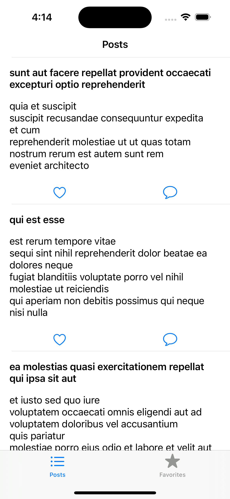

<h1 align="center">Posts App</h1>

<h3>About</h3>

The Post app is an application to see the posts.
 

The Post app can be used to check comments on a post and favourite a particular post.

<h3>Technologies Used</h3>
Swift 5.9.2, Xcode 15.2 
<h3>Features and Description</h3>

The Post app's features include:

<h4>Login</h4>

<h4>View Posts </h4>

<h4>View Favourites Post</h4>

<h4>View Comments</h4>

<h4>Code Coverage</h4>

 <h3> To-do </h3>
 <ul>
  <li> UI testing </li> 
  <li> CI/CD </li>
 </ul>

